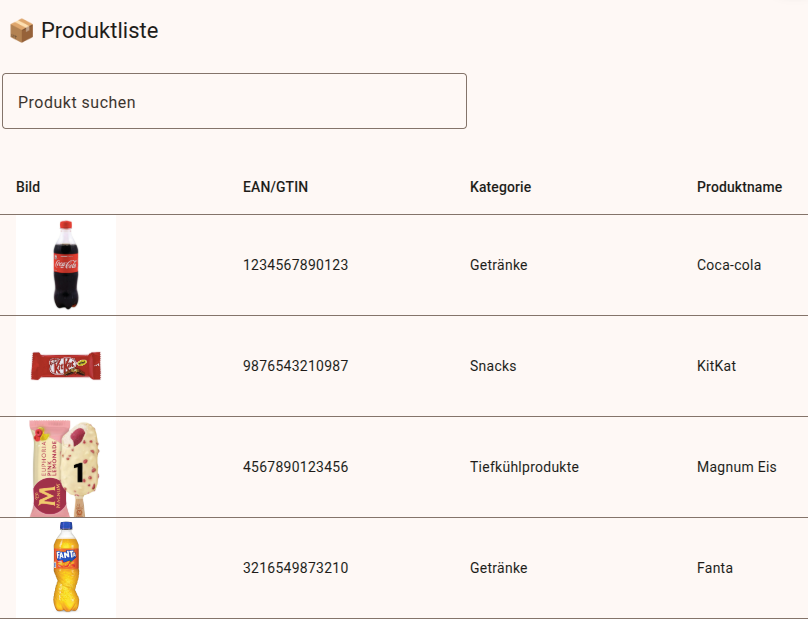
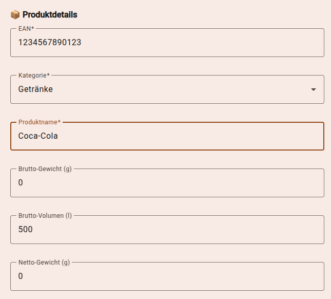

# Produktmanager Frontend & Backend

Dieses Projekt ist eine Webanwendung zur Verwaltung von Produkten, die es ermöglicht, Produkte hinzuzufügen, zu aktualisieren, anzuzeigen und zu löschen. Es besteht aus einem **Angular-Frontend** und einem **Node.js-Backend** mit Verbindung zu einer **PostgreSQL-Datenbank**.

# Funktionalitäten

Das Produktmanager-Projekt ermöglicht folgende Funktionen:

- **Produkterstellung:** Benutzer können neue Produkte mit Kategorien, Herstellerinformationen, Zutaten und Nährwertinformationen hinzufügen.
- **Produktanzeige:** Eine Liste aller vorhandenen Produkte wird angezeigt, mit Detailansichten für jedes Produkt.
- **Produktbearbeitung:** Bereits erstellte Produkte können aktualisiert werden.
- **Produktlöschung:** Benutzer können Produkte löschen.
- **Datenverwaltung:** Automatische Verbindung zu einer PostgreSQL-Datenbank.
- **Benutzerfreundliche Oberfläche:** Verwenden von Angular Material für ein ansprechendes und intuitives Design.

## 📦 Produktliste
Dies ist die Hauptansicht der Produktliste in der Anwendung.



---

## ➕ Produkt hinzufügen
Formular zum Hinzufügen eines neuen Produkts.


---

## 🔍 Produkt Details
Detailansicht eines spezifischen Produkts.


## 🔍 Produkt Bearbeiten
Detailansicht eines spezifischen Produkts.



## Installation

### Voraussetzungen

- Node.js (mindestens Version 16)
- npm (mit Node.js installiert)
- PostgreSQL Datenbank

### Backend Setup

1. Klone das Repository:

```bash
  git clone https://github.com/goncabi/produktmanager-backend.git
```

2. Navigiere in das Backend-Verzeichnis:

```bash
  cd produktmanager-backend
```

3. Installiere die Abhängigkeiten:

```bash
  npm install
```

4. Erstelle eine `.env` Datei im Backend-Verzeichnis mit folgendem Inhalt:

```
  DB_USER=<DeinBenutzername>
  DB_PASSWORD=<DeinPasswort>
  DB_HOST=<DatenbankHost>
  DB_NAME=produktmanager
  DB_PORT=5432
```

5. Starte den Server:

```bash
  node server.js
```

### Frontend Setup

1. Klone das Repository:

```bash
  git clone https://github.com/goncabi/produktmanager-frontend.git
```

2. Navigiere in das Frontend-Verzeichnis:

```bash
  cd produktmanager-frontend
```

3. Installiere die Abhängigkeiten:

```bash
  npm install
```

4. Starte das Frontend:

```bash
  ng serve
```

### Deployment

#### Backend Deployment (Render)

1. Stelle sicher, dass deine Umgebungsvariablen auf Render gesetzt sind (DB\_USER, DB\_PASSWORD, DB\_HOST, DB\_NAME, DB\_PORT).
2. Lade das Repository auf Render hoch und starte die Anwendung.

#### Frontend Deployment (Render)

1. Stelle sicher, dass `angular.json` den richtigen `outputPath` (`dist/frontend/browser`) definiert.
2. Stelle sicher, dass du `ng build` ausführst, bevor du deployst.
3. Lade die gebauten Dateien (`dist/frontend/browser`) auf Render hoch.

### Verwendung

Das Frontend kann auf `http://localhost:4200` aufgerufen werden. Das Backend läuft auf `http://localhost:5000`.

### Technologien

- Angular (Frontend)
- Angular Material
- Node.js (Backend)
- Express
- PostgreSQL

### Quellen

- Wo ChatGPT unterstützt hat:
  - Unterstützung bei der Erstellung von Angular-Komponenten.
  - Hilfe beim Aufbau von Backend-Routen.
  - Beratung bei der Verbindung mit der Datenbank.
  - Unterstützung bei der Fehlerbehebung während des Deployments.
  - Verbesserung der Projektstruktur und der Kommunikation zwischen Frontend und Backend.
  - Optimierung der Datenverarbeitung und Validierung im Backend.

Viel Spaß beim Verwenden des Produktmanagers! 🚀

